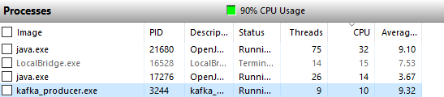

# HPQ(High Performance Quotation)
## 1、Golang Client
* [confluent-kafka-go](https://github.com/confluentinc/confluent-kafka-go.git), base on C/C++ library:[librdkafka](https://github.com/edenhill/librdkafka), high performance, but a bit hard to install and use.
* [sarama](https://github.com/Shopify/sarama.git), pure Golang Client, easy to install and use.

Finally, I choose sarama to test.

## 2、How to run 
* git clone https://github.com/CHCP/quotation.git

* go build -o kafka_producer kafka_producer.go

* go build -o kafka_consumer kafka_consumer.go

## 3、Producer Performance Test
* Async Test Result: 80000msg/sec,CPU:60%
  

  

* Sync Test Result: 1200msg/sec, CPU:10%

  

  

## 4、Consumer Performance Test: 70000msg/sec

  

